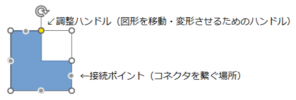
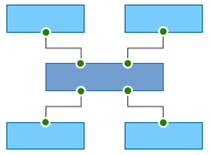
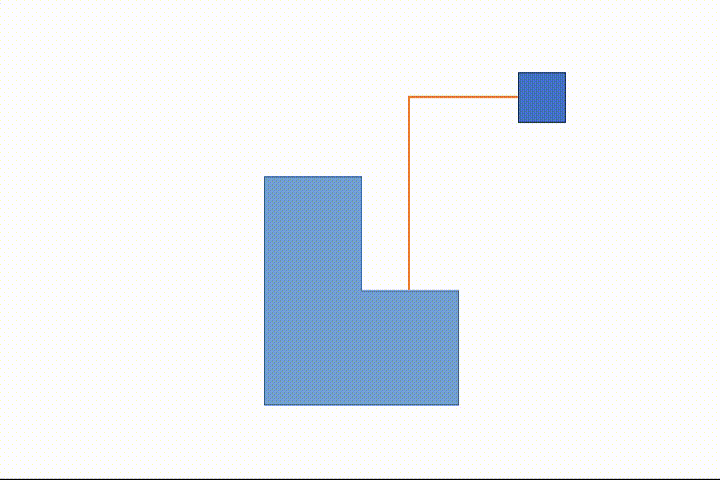
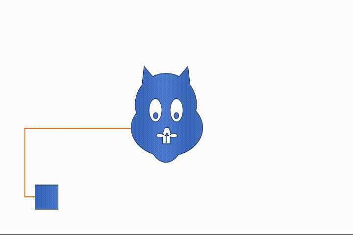
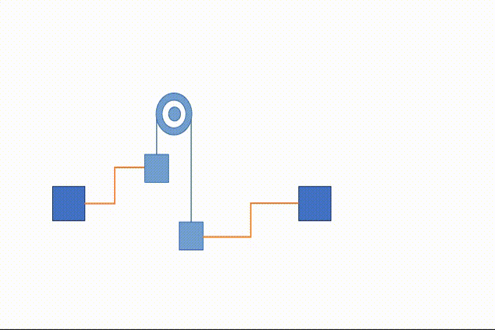
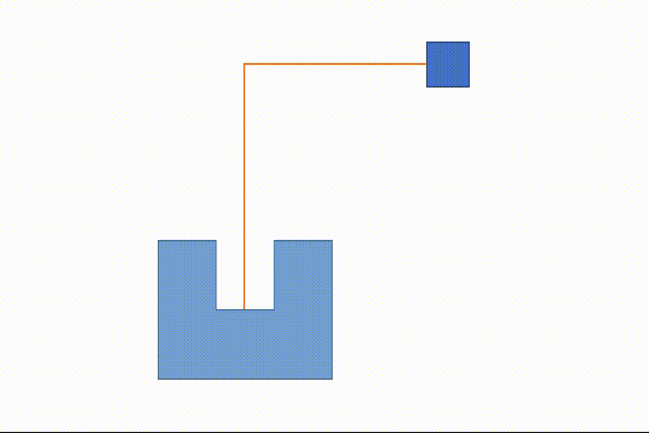
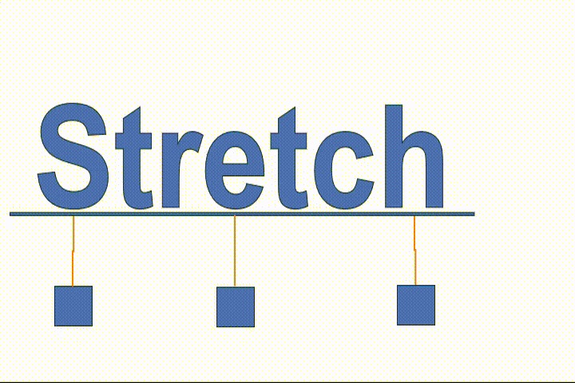
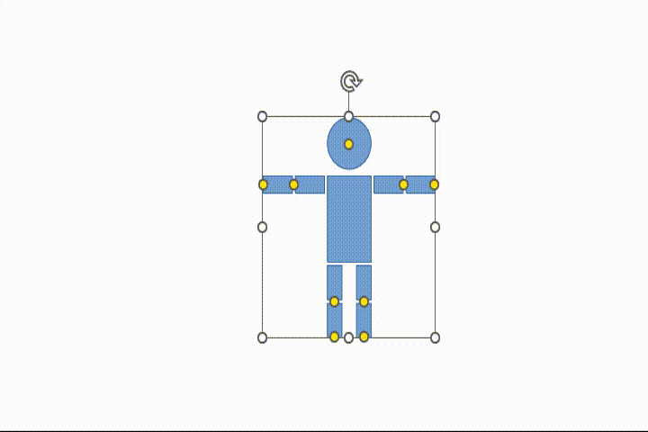

# [OfficeShapeTool](https://github.com/Yz-Filer/OfficeShapeTool)
## はじめに
Office Open XML（以降OOXML）のプレゼンテーション形式（以降pptx形式）で保存されたファイル内の図形に接続ポイントと調整ハンドルを追加するフリーのツールを[OfficeShapeTool](https://www.vector.co.jp/soft/winnt/business/se526365.html)に公開しました。  
出力形式は、pptx形式とOpenDocumentのプレゼンテーション形式（以降odp形式）の2種類となります。  
　  
　・接続ポイント  
　　Glue Point、cxn、Connection Point、接着ポイント、コネクションポイントとも呼ばれてる物  
　・調整ハンドル  
　　Adjust Handle、Handle、アジャストハンドルとも呼ばれてる物
　<table><tr><td>
  
  </td></tr></table>

## 作成例
　・複数の接続ポイントを指定した角度（90度単位）で追加
　<table><tr><td>
　
  </td></tr></table>

　・画像の任意の場所に接続ポイントを追加（v2から）
　<table><tr><td>
　
  </td></tr></table>

　・調整ハンドルの移動に伴う、図形の変形と接続ポイントの移動
　<table><tr><td>
　
  </td></tr></table>

　・調整ハンドルの移動に伴う、左右方向の変形
　<table><tr><td>
　
  </td></tr></table>

　・調整ハンドルの移動に伴う、上下方向の変形
　<table><tr><td>
　
  </td></tr></table>

　・調整ハンドルの移動に伴う、上下左右方向の変形
　<table><tr><td>
　
  </td></tr></table>

　・調整ハンドルの移動に伴う、移動と変形
　<table><tr><td>
　
  </td></tr></table>

　・複数調整ハンドルの移動に伴う、図形の変形
　<table><tr><td>
　
  </td></tr></table>
