# [OfficeShapeTool](https://github.com/Yz-Filer/OfficeShapeTool)
## はじめに
Office Open XML（以降OOXML）のプレゼンテーション形式（以降pptx形式）で保存されたファイル内の図形に接続ポイントと調整ハンドルを追加するフリーのツールを[OfficeShapeTool](https://www.vector.co.jp/soft/winnt/business/se526365.html)に公開しました。  
出力形式は、pptx形式とOpenDocumentのプレゼンテーション形式（以降odp形式）の2種類となります。  

  - 接続ポイント  
      Glue Point、cxn、Connection Point、接着ポイント、コネクションポイントとも呼ばれてる物

  - 調整ハンドル  
      Adjust Handle、Handle、アジャストハンドルとも呼ばれてる物  

  <table><tr><td>
    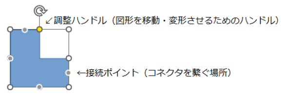
  </td></tr></table>  

1. 手順通りに作成した限定的なファイルのみに対応しています。
    - pptx標準図形は、カスタム図形への変換が必要です。
    - 複数の図形を含むファイルには対応していません。
    - グループ化された図形には対応していません。
    - WEB版のOfficeでは上手く表示されない可能性があります。

2. V2より、以下の対応を行っています。  
    - 接続点タブ、調整hdlタブに全削除ボタン追加
    - 調整対象タブにて、対象外のポイントは表示しないよう変更
    - 調整対象タブにて、対象に追加したポイントは色を変更
    - 画像に対応

3. V3より、以下の対応を行っています。
    - 本ツールで保存したpptxファイルの読み込み
    - 調整ハンドルの移動範囲を図形領域外に設定可能

4. V4より、以下の対応を行っています。
    - 図形領域の中央を基準とした回転移動（角度変更）・放射移動（半径変更）

## インストール・設定  

- .net framework4.7.2以上のWindows環境で動作します。
（Windows10以降なら問題ないと思います）  
- レジストリは使用していません。任意のディレクトリに解凍して下さい。  
- アンインストールはディレクトリごと削除して下さい。

## 入力ファイルの準備  

LibreOffice ImpressはOOXML形式の接続ポイントと調整ハンドルの入出力には対応してないようです。そのため、本ツールが対応してない情報が含まれておらず、入力ファイルとして問題が起こる可能性が低いため、LibreOfficeを使った手順を説明します。  

1. LibreOffice Impressを起動したら、スライド内の全てのオブジェクトを削除。
    <table><tr><td>
      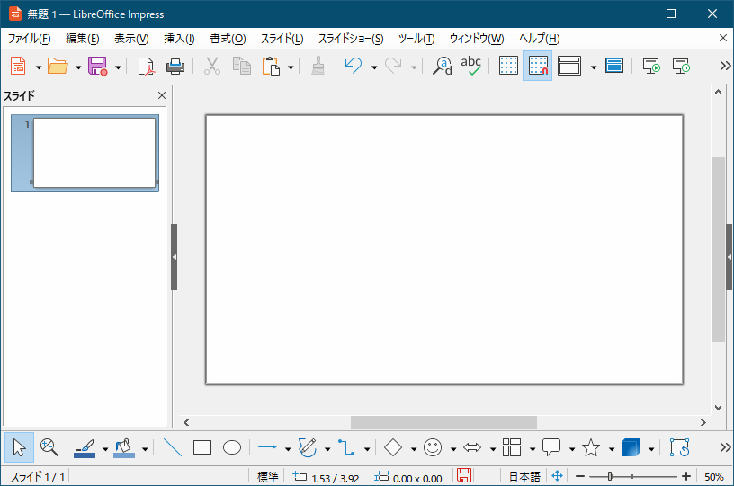
    </td></tr></table>  

2. 縦横比が2：1、1：2の長方形を作成。
    <table><tr><td>
      
    </td></tr></table>  

3. 両方の図形を含むようマウスで囲う。
    <table><tr><td>
      
    </td></tr></table>  

4. 右クリック→「オブジェクトの整列」→「左揃え」
    <table><tr><td>
      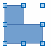
    </td></tr></table>  

5. 同様に、右クリック→「オブジェクトの整列」→「下揃え」
    <table><tr><td>
      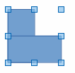
    </td></tr></table>  

6. 右クリック→「シェイプ」→「合わせて１つにする」
    <table><tr><td>
      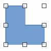
    </td></tr></table>  

    これで、標準図形２つが１つのカスタム図形に変換されました。（本ツールではカスタム図形にしか対応していません）

    四角形や円など１つの標準図形をカスタム図形に変換するには、  
    &emsp;右クリック→「変換」→「曲線に変換」 or 「多角形に変換」 or 「輪郭に変換」  
    で変換するか、何か別の図形を離した場所に置いて  
    &emsp;「シェイプ」→「合わせて１つにする」 と「１つにして引く」  
    の手順を組合わせて図形を切り貼りすることで、１つの図形だけ残した図形が作成できます。
    
    PowerPointの場合も、「図形の合成」や「頂点の編集」などで標準図形を加工する処理や、svg画像の場合は「図形に変換」をするとカスタム図形に変換されます。  

7. 作成した図形がグループ化された図形になっていないことの確認  
図形を右クリックして、メニュー内に「グループ解除」が表示されている場合は、複数の図形がグループ化されているため、入力対象外の図形となります。
グループ解除後、１つの図形以外は削除するか、１つのカスタム図形になるよう作成し直してください。

8. 保存  
メニュー→「ファイル」→「名前を付けて保存」→「ファイルの種類」  
&emsp;・PowerPoint 2007-365（*.pptx）  
もしくは  
&emsp;・Office Open XML プレゼンテーション（*.pptx）  
の形式で保存して下さい。

## ツールの使い方  

1. ツールを起動し、メニュー→「ファイル」→「開く」から、作成したpptxファイルを開いてください。
    <table><tr><td>
      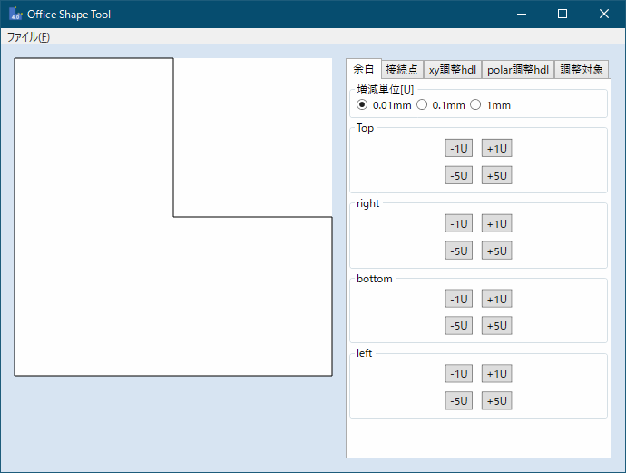
    </td></tr></table> 

- 「余白」タブ  
図形の上下左右に余白を追加・削除します。
　
- 「接続点」タブ  
接続ポイントを追加・設定します。

- 「調整hdl」タブ  
調整ハンドルを追加・設定します。

- 「調整対象」タブ  
各調整ハンドルと紐づく接続ポイント・エディットポイントを設定します。

  > **ℹ️ information**  
  > ※エディットポイントとは、図形を構成する座標（直線の場合、始点と終点）となります。

2. 余白の追加  
    <table><tr><td>
      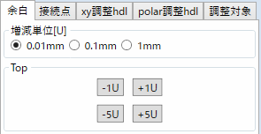
    </td></tr></table>  

    増減単位（U）を選択し、追加する場合「+1U」「+5U」を、削減する場合「-1U」「-5U」を
クリックします。  
    - 1U=増減単位で選択した長さ  
    - 5U=1Uの5倍  

    以下は、余白追加前後でPowerPointにて図形を選択した時に囲われる領域の比較になります。  
    <table><tr><td>
      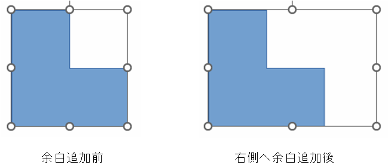
    </td></tr></table>  

    > **ℹ️ information**  
    > ※元のサイズ以下になるような余白の削減は出来ません。  
    > ※LibreOfficeの場合、小さい画像を大きく表示しているので、「増減単位」は「0.01mm」が良いと思います。  
    > ※LibreOffice以外の場合で、「0.01mm」では増減したように見えない場合は「1mm」に
設定してみて下さい。  
    > ※図形表示領域をマウスの左ボタンでクリックすると、そこが中心になるよう余白が追加
されます。

3. 接続ポイントの追加  
「接続点」タブで「追加」を押すと、図形の真ん中あたりに点が追加されます。  
（赤い点が接続点。緑色の線は接続点を見つけやすくするためのガイド線）  
    <table><tr><td>
      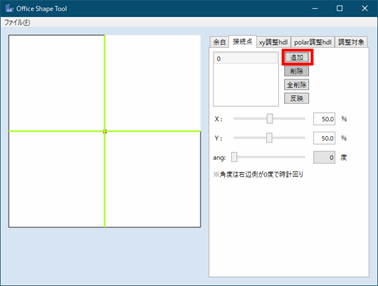
    </td></tr></table>  

    &emsp;X：接続点の横位置(%)  
    &emsp;Y：接続点の縦位置(%)  
    &emsp;ang：接続点へ接続するコネクタの角度（90度単位。右辺側が0度で時計回り）  

    今回は、  
    &emsp;X=75  
    &emsp;Y=50  
    &emsp;ang=270  
    に設定します。  
    （図形表示領域をマウス左ボタンでクリックすることでもX, Yを指定出来ます）

    最後に、「反映」を押して設定した内容を反映します。
    <table><tr><td>
      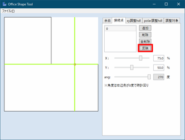
    </td></tr></table>  

    > **ℹ️ information**  
    > ※LibreOfficeでは、接続点の角度指定には対応してないためodp形式で保存した場合は角度指定が無効となります。（角度指定をしたい場合は、LibreOfficeの機能を使って追加した方が良いです）  
    > ※LibreOfficeでは、接続点は図形領域内に限定されてるためodp形式で保存した場合は調整ハンドルの設定により接続点を図形領域外に移動させようとしても、図形領域内の範囲でしか移動されません。

4. xy調整ハンドル（水平/垂直方向の移動用ハンドル）の追加  
   「xy調整hdl」タブで「追加」を押すと、図形の真ん中あたりに点が追加されます。
    <table><tr><td>
      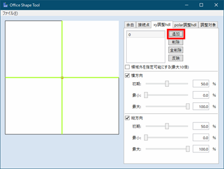
    </td></tr></table>  

    図形の領域より外に調整ハンドルを移動させたい場合、「領域外を指定可能にする（最大10倍）」のチェックボックスをチェックします。
    - チェック前の各スライダーの移動範囲：0%～100%
    - チェック後の各スライダーの移動範囲：-1000%~1000%
      > **ℹ️ information**  
      > ※「初期」のスライダーは図形領域内のみの指定となります。  
    
    調整ハンドルは、横方向のみ、縦方向のみ、縦横両方向が選択できます。
    - 「横方向」「縦方向」チェックボックス：調整ハンドルの移動方向の選択  

    - 初期：図形が表示された時の初期位置(%)  
      > **ℹ️ information**  
      > ※初期位置は選択されてない「方向」の場合でも設定が必要です。   
      > ※図形表示領域をマウス左ボタンでクリックすることでも指定出来ます。
    - 最小：調整ハンドルの移動範囲の最小位置(%)
    - 最大：調整ハンドルの移動範囲の最大位置(%)  

   > **⚠️ warning**  
   > ※「調整対象」タブで紐づけ後の場合、変更すると紐づけが切断されるので注意  
   > ※PowerPointの規格上8個を超える調整ハンドルは許容されない可能性があります。  
    
    今回は、横方向と縦方向１つずつ調整ハンドルを設定します。  
    &emsp;0：  
    &emsp;&emsp;横方向チェック  
    &emsp;&emsp;&emsp;初期=50  
    &emsp;&emsp;&emsp;最小=0  
    &emsp;&emsp;&emsp;最大=100  
    &emsp;&emsp;縦方向はチェックせず  
    &emsp;&emsp;&emsp;初期=0  
    「反映」を押して0に設定した内容を反映します。  
    その後「追加」を押します。  
    &emsp;1：  
    &emsp;&emsp;横方向はチェックせず  
    &emsp;&emsp;&emsp;初期=100  
    &emsp;&emsp;縦方向チェック  
    &emsp;&emsp;&emsp;初期=50  
    &emsp;&emsp;&emsp;最小=0  
    &emsp;&emsp;&emsp;最大=100  
    「反映」を押して1に設定した内容を反映します。  
    
    <table><tr><td>
      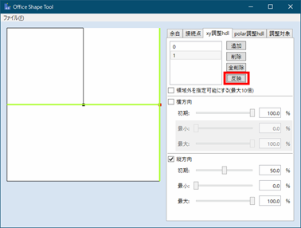
    </td></tr></table>  

5. 調整ハンドルと調整対象を紐づけ  
「調整対象」タブで「0」の調整ハンドルを選択します。  
オレンジ色の点が調整ハンドルの位置となります。
    <table><tr><td>
      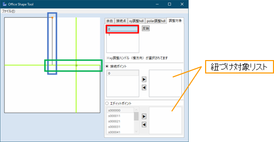
    </td></tr></table>  

    横方向へ調整ハンドルと連動して動かす点をマウスで範囲選択して、「▶」ボタンで対象リストに追加します。  
    （リストボックスで選択して「▶」ボタンでも可）  
&emsp;接続ポイント：0  
&emsp;エディットポイント：図の青枠の中の点  
「反映」を押して調整ハンドル0に設定した内容を反映します。

    その後「1」を選択して縦方向へ調整ハンドルと連動して動く点をマウスで範囲選択して、「▶」ボタンで対象リストに追加します。  
    （リストボックスで選択して「▶」ボタンでも可）  
&emsp;接続ポイント：0  
&emsp;エディットポイント：図の緑枠の中の点  
「反映」を押して調整ハンドル1に設定した内容を反映します。

    > **ℹ️ information**  
    > ※接続ポイントもエディットポイントも同一方向の調整ハンドルへの紐づけは1つの調整ハンドルまでとなります。今回は調整ハンドル0、1が横方向と縦方向で別方向だったため両方の調整ハンドルへ紐づけ出来ています。既に他の調整ハンドルに紐づいており、紐づけ出来ない点はリストに表示されません。  
    > ※リストボックスでは矢印キー上下での移動が出来ます。  
    > ※図形によっては、始点と終点が同じ座標の場合があるため、点が重なって表示されてることがあります。

    この状態で保存してしまうと以下のように、横方向調整ハンドルを端まで動かした場合
接続ポイントがはみ出してしまいます。  
    <table><tr><td>
      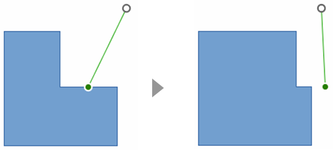
    </td></tr></table>  

    調整ハンドルの右端までの移動量を1とすると、接続ポイントの右端までの移動量は1/2となりますので、接続ポイントの移動量を1/2に設定します。
    <table><tr><td>
      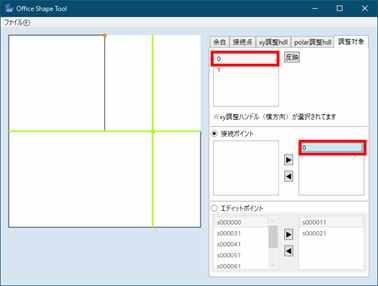
    </td></tr></table>  

    「0」の調整ハンドルを選択し、「0」の接続ポイントをダブルクリックすると以下のダイアログが表示されます。  
    
    > **ℹ️ information**  
    > ※接続ポイント、エディットポイントの右側のリストボックスは、SHIFキーやCTRLキーを使って、複数選択可能です。  
    &emsp;複数選択したままダブルクリックする場合は、SHIFTキーやCTRLキーを押したままダブルクリックして下さい。
    <table><tr><td>
      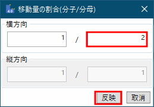
    </td></tr></table> 

    調整ハンドルの移動量に対する移動割合を分数で指定します。  
    今回は1/2に設定し、「反映」を押します。  

    > **ℹ️ information**  
    > ※「反映」を押した時点で接続ポイントの移動割合は設定されます。  
    > ※負の値を設定すると調整ハンドルと反対方向へ移動します。  
    > ※横方向調整ハンドルなので縦方向は編集不可となっています。  

    マウスで領域指定後、右クリックメニューで設定することも出来ます。
    <table><tr><td>
      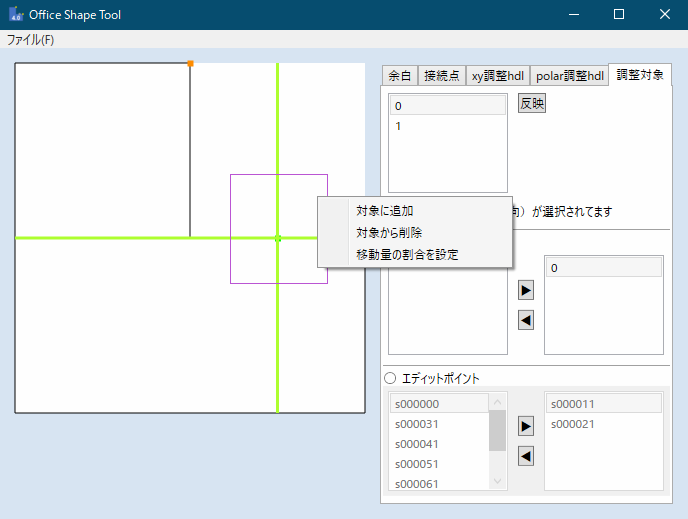
    </td></tr></table>  

    > **ℹ️ information**  
    > ※領域指定内に存在するポイントであっても、対象外の物や既に追加／削除済みの物は無視されます

6. 【参考】ベジエ曲線（ベジェ曲線）  
    <table><tr><td>
      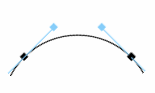
    </td></tr></table>  

    エディットポイントの選択時に、表示される黒い点が始点・終点、水色の点が制御点となっており、この4点で曲線が描かれています。黒い点を調整ハンドルと連動して動かす場合は、水色の点も含めるかどうか検討して下さい。  
    （水色の点だけを調整ハンドルと連動させることも出来ます）

7. 保存  
    メニュー→「ファイル」→「保存（pptx）」か「保存（odp）」を選択すると、入力ファイル名の末尾に「_a」がついたファイルが保存されます。  
    > **⚠️ warning**  
    > 本ツールはpptx形式のみの読み込み対応のため、odp形式の保存で再編集の可能性がある場合は、pptx形式でも保存しておいて下さい。

8. 動作確認  
保存したファイルをPowerPointかLibreOfficeで開いて想定した動作になっているかどうかを確認します。（拡張子pptxはPowerPointで、拡張子odpはLibreOfficeで開いてください）  
線の色や図形の色がついてない場合があるかもしれないので、その場合は、PowerPointかLibreOfficeのメニューから任意の色を設定して下さい。
    <table><tr><td>
      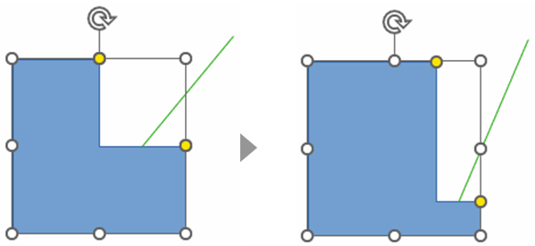
    </td></tr></table>  

## 作成例
・複数の接続ポイントを指定した角度（90度単位）で追加

  <table><tr><td>
    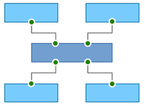
  </td></tr></table>

・画像の任意の場所に接続ポイントを追加（v2から）

  <table><tr><td>
    
  </td></tr></table>

・調整ハンドルの移動に伴う、図形の変形と接続ポイントの移動

  <table><tr><td>
    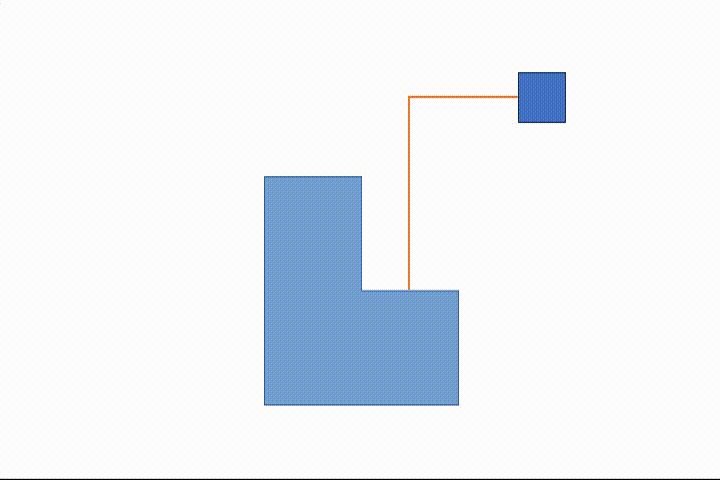
  </td></tr></table>

・調整ハンドルの移動に伴う、左右方向の変形

  <table><tr><td>
    
  </td></tr></table>

・調整ハンドルの移動に伴う、上下方向の変形

  <table><tr><td>
    
  </td></tr></table>

・調整ハンドルの移動に伴う、上下左右方向の変形

  <table><tr><td>
    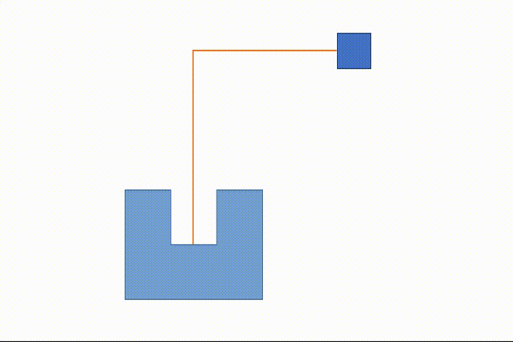
  </td></tr></table>

・調整ハンドルの移動に伴う、移動と変形

  <table><tr><td>
    
  </td></tr></table>

・複数調整ハンドルの移動に伴う、図形の変形

  <table><tr><td>
    
  </td></tr></table>
